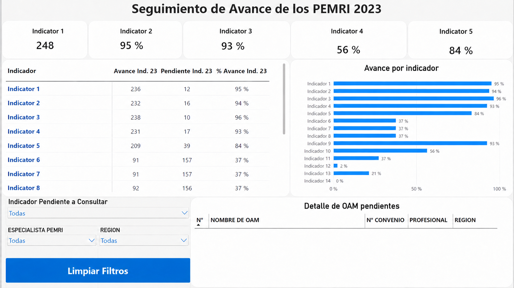
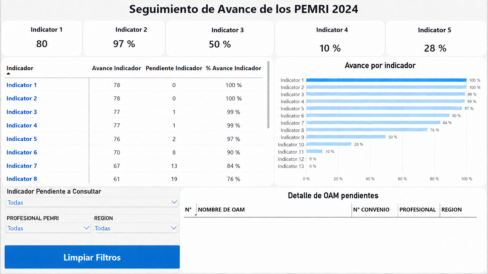

# 📊 PEMRI Monitoring Dashboard | Python + Power BI



## Introduction

This project documents an end-to-end operational monitoring workflow built with **Python, Excel, Power Query, DAX, and Power BI**.

The main challenge was to consolidate information distributed across multiple Excel workbooks, validate record-level changes, preserve traceability, and transform the final dataset into an interactive Power BI dashboard for progress monitoring and pending-item analysis.

The project includes two reporting cycles with different consolidation requirements. The 2024 workflow focuses on comparing a master tracking file with multiple same-structure specialist workbooks, while the 2023 workflow adds complementary administrative and resolution registers with source-specific priority rules.

> **Confidentiality note:** This repository contains only anonymized screenshots and synthetic demonstration notebooks. Original Excel files, Power BI source files, organization names, internal identifiers, staff names, document references, and confidential operational data are not included.

---

## 📁 Project Files

- [`01_multi_source_consolidation_2024_demo.ipynb`](notebooks/01_multi_source_consolidation_2024_demo.ipynb) — sanitized demonstration of the 2024 multi-source consolidation workflow
- [`02_multi_source_consolidation_2023_demo.ipynb`](notebooks/02_multi_source_consolidation_2023_demo.ipynb) — sanitized demonstration of the 2023 workflow with complementary administrative sources
- `images/` — anonymized Power BI dashboard screenshots

The original `.pbix` and source Excel files are intentionally excluded from this public repository.

---

## 🛠️ Skills Used

- Python
- Pandas
- NumPy
- Jupyter Notebook
- Excel
- Power Query
- Power BI
- DAX Measures
- Data Cleaning
- Data Validation
- Multi-Source Data Consolidation
- Conflict Detection
- Source-Priority Rules
- Traceability Logs
- KPI Cards
- Matrix / Table Visuals
- Bar Charts
- Slicers
- Bookmarks
- Interactive Filtering
- Pending-Item Analysis
- Dashboard Design

---

## 🐍 Data Consolidation with Python

A major part of this project was the automation of Excel consolidation before the data reached Power BI.

### 2024 Workflow

The 2024 process used a master workbook as the reference dataset and compared it against several specialist workbooks.

The workflow included:

- identifying a reliable unique record key
- validating duplicates before consolidation
- reading multiple Excel sources with Pandas
- normalizing text and missing values
- comparing records by **record + column**
- identifying unique updates
- separating conflicts from non-conflicting changes
- applying validated updates only
- preserving a traceability table
- validating the final consolidated dataset before export

The key principle was to avoid replacing the entire master file with the newest workbook. Instead, the process identified exactly which cells had changed and whether those changes could be safely incorporated.

---

## 🔄 Advanced 2023 Consolidation Workflow

The 2023 workflow required an additional layer of integration because not every source had the same structure as the master workbook.

The process combined:

1. same-structure follow-up workbooks
2. a complementary administrative-status register
3. a dedicated resolution register

Different fields followed different source-priority rules.

For example, a complementary source could:

- override a status field
- fill a reference field only when the master value was blank
- provide the authoritative value for a resolution number or date

This approach made the workflow more flexible than a simple append or merge operation.

---

## 🔍 Data Validation

The consolidated datasets were not accepted simply because the Python scripts completed without errors.

Validation steps included:

- row-count checks
- unique-key validation
- duplicate detection
- comparison against source workbooks
- review of applied changes
- source-level traceability
- verification of final reporting fields

This validation step was essential before connecting the datasets to Power BI.

---

## 📊 Power BI Dashboard

The final reporting layer was built in Power BI to transform the consolidated operational dataset into a monitoring tool.

### Main Components

- KPI cards
- progress matrix
- progress-by-indicator bar chart
- dynamic pending-item table
- professional slicer
- region slicer
- indicator slicer
- clear-filters bookmark button

The dashboard allows users to move from a high-level progress view to the exact records that remain pending.

---

## 📈 2023 Dashboard


The public screenshot keeps the original KPI values and dashboard structure while replacing confidential indicator names with generic labels.

The report contains:

- 5 KPI cards
- a dynamic progress matrix
- a 14-step progress chart
- interactive slicers
- a pending-record detail table
- reset-filter functionality

---

## 📈 2024 Dashboard



The 2024 dashboard uses the same monitoring concept with a different indicator structure and reporting universe.

The dashboard demonstrates how a common reporting design can be reused while adapting the underlying DAX logic and data model to a different operational cycle.

---

## 🧮 DAX & Interactive Logic

The Power BI report uses reusable measures to calculate completed records, pending records, and completion percentages.

A disconnected indicator table is used together with functions such as:

- `CALCULATE`
- `COUNTROWS`
- `DISTINCTCOUNT`
- `DIVIDE`
- `SELECTEDVALUE`
- `SWITCH`
- `COALESCE`
- `ISBLANK`
- `FILTER`
- `ALLSELECTED`

This allows one matrix and one chart to dynamically display multiple operational indicators.

A dedicated pending-record measure also changes its logic based on the indicator selected by the user.

---

## 🎛️ Interactive Monitoring

Users can filter the report by:

- indicator
- responsible professional
- region

The pending-detail table then shows only records that still require attention under the selected condition.

A bookmark-based **Clear Filters** button restores the report to its default state.

---

## 💡 Project Outcome

This project demonstrates a complete analytics workflow rather than only a final visualization.

The main technical progression was:

**Multiple Excel Files → Python Consolidation → Data Validation → Power BI Modeling → DAX Measures → Interactive Monitoring Dashboard**

The project strengthened my practical skills in:

- Python automation
- Pandas data manipulation
- Excel consolidation
- data-quality control
- business-rule implementation
- Power Query
- DAX
- dashboard design
- interactive reporting

---

## 🔒 Data Privacy

The original project was developed using real operational data.

To protect confidentiality:

- original Excel workbooks are not included
- original Power BI files are not included
- real organization names are not included
- real staff names are not included
- internal identifiers and document numbers are not included
- indicator names in screenshots were anonymized
- notebooks use synthetic data and generic source names
- local file paths and internal folder structures were removed

The repository is intended to demonstrate the **technical workflow and analytical methodology**, not to publish the underlying operational data.

---

## 📁 Repository Structure

```text
PEMRI-Monitoring-Dashboard/
├── README.md
├── requirements.txt
├── .gitignore
├── images/
│   ├── pemri_2023_dashboard_anonymized.png
│   └── pemri_2024_dashboard_anonymized.png
└── notebooks/
    ├── 01_multi_source_consolidation_2024_demo.ipynb
    └── 02_multi_source_consolidation_2023_demo.ipynb
```

---

## Conclusion

This project shows how Python and Power BI can be combined to improve an operational reporting process that originally depended on multiple Excel workbooks.

Python was used to consolidate, validate, and trace changes across data sources, while Power BI transformed the final dataset into an interactive monitoring tool.

The result is a reusable workflow that reduces manual consolidation effort, improves data consistency, and makes pending operational items easier to identify and analyze.
